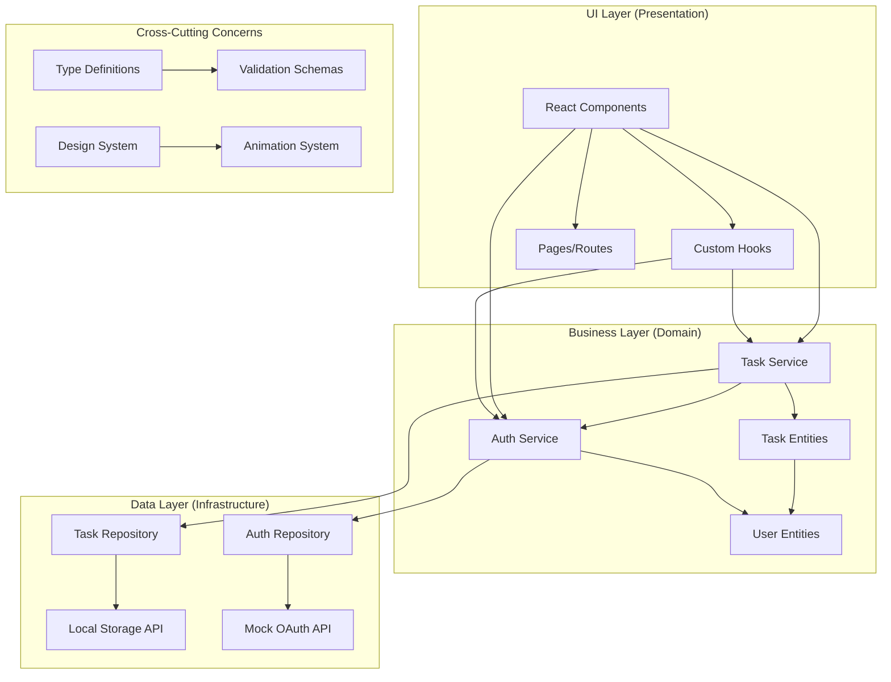

# FlowTask Architecture Documentation

## Overview

FlowTask follows Clean Architecture principles with MVVM pattern to ensure scalability, testability, and maintainability. The application is structured in layers with clear separation of concerns.

## Architecture Diagram



## Layer Breakdown

### 1. UI Layer (Presentation)

**Components Structure:**
```
src/components/
├── auth/               # Authentication UI
│   └── AuthScreen.tsx
├── layout/             # Layout components
│   └── Header.tsx
├── tasks/              # Task management UI
│   ├── TaskCard.tsx
│   ├── TaskForm.tsx
│   ├── TaskList.tsx
│   ├── TaskStats.tsx
│   └── TaskFilters.tsx
└── ui/                 # Reusable UI components (shadcn)
```

**Key Responsibilities:**
- Rendering UI components
- Handling user interactions
- Managing local component state
- Triggering business logic through services

**Design Patterns:**
- **Component Composition**: Building complex UIs from simple components
- **Props Drilling Prevention**: Using custom hooks for state management
- **Separation of Concerns**: UI logic separated from business logic

### 2. Business Layer (Domain)

**Services Structure:**
```
src/services/
├── taskService.ts      # Task business logic
└── authService.ts      # Authentication logic

src/hooks/
├── useTasks.ts         # Task state management
└── useAuth.ts          # Auth state management
```

**Key Responsibilities:**
- Business rules and validation
- Data transformation
- Coordinating between UI and data layers
- Error handling and logging

**Business Rules:**
- Task validation (title required, max lengths)
- Status transitions (open ↔ completed)
- Due date calculations and overdue detection
- Priority-based sorting and filtering

### 3. Data Layer (Infrastructure)

**Repository Structure:**
```
src/repositories/
└── taskRepository.ts   # Data access abstraction

Storage Strategy:
├── LocalStorage        # Client-side persistence
└── Future: API         # Ready for backend integration
```

**Key Responsibilities:**
- Data persistence and retrieval
- Data serialization/deserialization
- Storage abstraction
- Future API integration point

**Repository Pattern Benefits:**
- Easy testing with mock implementations
- Swappable storage backends
- Consistent data access interface
- Error boundary for data operations

## Design Patterns Used

### 1. Repository Pattern
```typescript
interface TaskRepository {
  getAll(): Promise<Task[]>;
  getById(id: string): Promise<Task | null>;
  create(task: Task): Promise<Task>;
  update(id: string, task: Task): Promise<Task | null>;
  delete(id: string): Promise<boolean>;
}
```

**Benefits:**
- Abstracted data access
- Easy unit testing
- Swappable implementations
- Consistent error handling

### 2. Service Layer Pattern
```typescript
class TaskService {
  constructor(private repository: TaskRepository) {}
  
  async createTask(data: CreateTaskData): Promise<Task> {
    // Business logic here
    const task = this.validateAndTransform(data);
    return await this.repository.create(task);
  }
}
```

**Benefits:**
- Centralized business logic
- Reusable across components
- Easier testing and maintenance
- Clear API boundaries

### 3. Custom Hooks Pattern
```typescript
function useTasks(filters?: TaskFilters) {
  const [tasks, setTasks] = useState<Task[]>([]);
  // State management and side effects
  return { tasks, createTask, updateTask, deleteTask };
}
```

**Benefits:**
- Reusable stateful logic
- Cleaner components
- Built-in React optimizations
- Easy to test and mock

### 4. MVVM (Model-View-ViewModel)
- **Model**: Task entities and business rules
- **View**: React components (UI)
- **ViewModel**: Custom hooks managing state and logic

## State Management Strategy

### Local State Management
```typescript
// Component-level state for UI interactions
const [showTaskForm, setShowTaskForm] = useState(false);

// Custom hooks for domain state
const { tasks, createTask, updateTask } = useTasks(filters);
const { user, signIn, signOut } = useAuth();
```

### State Flow
1. User interaction triggers event in component
2. Component calls custom hook method
3. Hook calls service layer
4. Service processes business logic
5. Service calls repository
6. Repository persists/retrieves data
7. State updates flow back through chain
8. UI re-renders with new state

## Error Handling Strategy

### Layered Error Handling
```typescript
// Repository Layer: Data access errors
catch (error) {
  console.error('Storage error:', error);
  throw new Error('Failed to save task');
}

// Service Layer: Business logic errors
catch (error) {
  if (error.message.includes('validation')) {
    throw new ValidationError(error.message);
  }
  throw error;
}

// Hook Layer: User-facing errors
catch (error) {
  toast({
    title: 'Error',
    description: error.message,
    variant: 'destructive'
  });
}
```

## Animation Architecture

### Framer Motion Integration
```typescript
// Component-level animations
<motion.div
  initial={{ opacity: 0, y: 20 }}
  animate={{ opacity: 1, y: 0 }}
  exit={{ opacity: 0, y: -20 }}
>

// Gesture handling
<motion.div
  drag="x"
  onDragEnd={handleSwipeDelete}
  dragConstraints={{ left: -150, right: 0 }}
>
```

### Animation System
- **Entrance**: Fade-in with slight vertical movement
- **Exit**: Fade-out with smooth transitions
- **Gesture**: Physics-based drag animations
- **State Changes**: Smooth color and scale transitions

## Security Considerations

### Data Protection
- **Input Validation**: Zod schemas for all user inputs
- **XSS Prevention**: React's built-in protections
- **Data Sanitization**: Clean user input before storage
- **Error Information**: No sensitive data in error messages

### Authentication Security
- **Token Storage**: Secure localStorage with expiration
- **Session Management**: Automatic cleanup on signout
- **Demo Mode**: Safe fallback without real credentials

## Performance Optimizations

### React Optimizations
```typescript
// Memoized computations
const taskStats = useMemo(() => calculateStats(tasks), [tasks]);

// Optimized re-renders
const TaskCard = memo(({ task, onUpdate }) => { ... });

// Efficient state updates
const updateTask = useCallback(async (id, data) => {
  // Optimistic update
  setTasks(prev => prev.map(task => 
    task.id === id ? { ...task, ...data } : task
  ));
}, []);
```

### Animation Performance
- **Hardware Acceleration**: GPU-accelerated animations
- **Will-Change**: Optimized for expected changes
- **Layout Animations**: Automatic layout transitions
- **Gesture Optimization**: Reduced re-renders during drag

## Testing Strategy

### Layer Testing
```typescript
// Repository Layer
describe('TaskRepository', () => {
  it('should save task to localStorage', async () => {
    const task = createMockTask();
    await repository.create(task);
    expect(localStorage.getItem).toHaveBeenCalled();
  });
});

// Service Layer
describe('TaskService', () => {
  it('should validate task data before creation', async () => {
    const invalidData = { title: '' };
    await expect(service.createTask(invalidData))
      .rejects.toThrow('Title is required');
  });
});

// Hook Layer
describe('useTasks', () => {
  it('should update task list after creation', async () => {
    const { result } = renderHook(() => useTasks());
    await act(() => result.current.createTask(mockTaskData));
    expect(result.current.tasks).toHaveLength(1);
  });
});
```

## Future Scalability

### API Integration Ready
```typescript
// Current: LocalStorageTaskRepository
// Future: ApiTaskRepository
class ApiTaskRepository implements TaskRepository {
  async getAll(): Promise<Task[]> {
    const response = await fetch('/api/tasks');
    return response.json();
  }
}
```

### State Management Evolution
- Current: React hooks + useState
- Future: Redux Toolkit or Zustand for complex state
- Server State: React Query for API caching

### Mobile Native Features
- Push notifications
- Offline sync
- Background processing
- Native calendar integration

## Conclusion

This architecture provides:
- ✅ **Scalability**: Easy to add new features
- ✅ **Testability**: Clear layer separation for testing
- ✅ **Maintainability**: Well-organized code structure
- ✅ **Performance**: Optimized React patterns
- ✅ **Mobile-Ready**: Capacitor integration prepared
- ✅ **Future-Proof**: Ready for API integration and advanced features