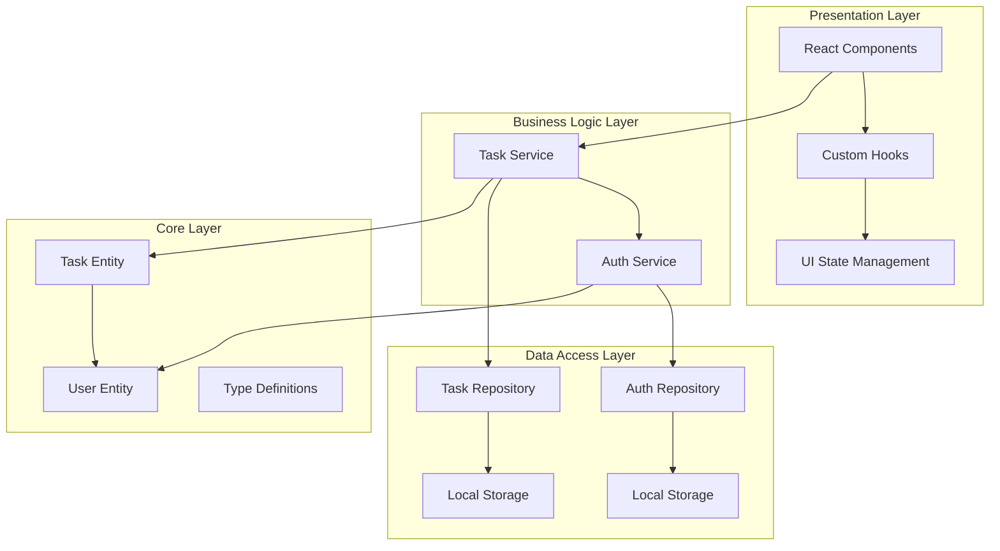

# FlowTask - Cross-Platform Todo Management App

**Built for Katomaran Hackathon**

A beautiful, feature-rich task management application built with React, TypeScript, and Capacitor for cross-platform mobile deployment.

## 🎯 Features

### ✅ Core Functionality
- **Full CRUD Operations**: Create, read, update, and delete tasks
- **Task Properties**: Title, description, due date, priority levels, completion status
- **Smart Filtering**: Filter by status, priority, and search functionality
- **Sorting Options**: Sort by creation date, due date, or priority

### 📱 Mobile-First Experience
- **Responsive Design**: Optimized for mobile devices with touch-friendly interfaces
- **Swipe Gestures**: Swipe-to-delete functionality for intuitive task management
- **Pull-to-Refresh**: Native-like refresh experience
- **Floating Action Button**: Quick task creation with material design FAB

### 🎨 Beautiful UI/UX
- **Smooth Animations**: Framer Motion powered animations for all interactions
- **Modern Design System**: Custom design tokens with HSL color system
- **Dark/Light Mode**: Automatic theme support
- **Loading States**: Elegant loading skeletons and states
- **Empty States**: Helpful messaging when no tasks are present

### 🔐 Authentication
- **Google OAuth**: Secure social login (demo mode available)
- **Session Management**: Persistent login state with localStorage
- **User Profile**: Avatar and user information display

### ⚡ Performance & Architecture
- **Clean Architecture**: MVVM pattern with separation of concerns
- **TypeScript**: Full type safety throughout the application
- **Local Storage**: Client-side data persistence
- **Optimistic Updates**: Instant UI feedback with error handling

## 🏗️ Architecture

### Project Structure
```
src/
├── components/           # React components
│   ├── auth/            # Authentication components
│   ├── layout/          # Layout components
│   ├── tasks/           # Task-related components
│   └── ui/              # Reusable UI components (shadcn/ui)
├── hooks/               # Custom React hooks
├── services/            # Business logic layer
├── repositories/        # Data access layer
├── types/               # TypeScript type definitions
└── lib/                 # Utility functions
```

### Architecture Pattern: Clean Architecture + MVVM



### Key Architectural Decisions

1. **Separation of Concerns**: Business logic separated from UI components
2. **Repository Pattern**: Abstracted data access for easy testing and future API integration
3. **Custom Hooks**: Encapsulated state management and side effects
4. **Type Safety**: Comprehensive TypeScript interfaces and enums
5. **Design System**: Centralized theming with CSS custom properties

## 🚀 Getting Started

### Prerequisites
- Node.js 18+ 
- npm or yarn
- For mobile development: Android Studio (Android) or Xcode (iOS)

### Installation

1. **Clone the repository**
```bash
git clone <repository-url>
cd katomaran-flowtask
```

2. **Install dependencies**
```bash
npm install
```

3. **Start development server**
```bash
npm run dev
```

4. **Initialize Capacitor (for mobile)**
```bash
npx cap init
```

### Mobile Development Setup

1. **Add mobile platforms**
```bash
# For Android
npx cap add android

# For iOS (macOS only)
npx cap add ios
```

2. **Build and sync**
```bash
npm run build
npx cap sync
```

3. **Run on device/emulator**
```bash
# Android
npx cap run android

# iOS
npx cap run ios
```

## 📱 Mobile Deployment

### Generate APK for Android

1. **Build the web app**
```bash
npm run build
```

2. **Sync with Capacitor**
```bash
npx cap sync android
```

3. **Open in Android Studio**
```bash
npx cap open android
```

4. **Build APK in Android Studio**
   - Go to `Build` → `Build Bundle(s) / APK(s)` → `Build APK(s)`
   - APK will be generated in `android/app/build/outputs/apk/debug/`

### For Production

1. **Configure app signing**
2. **Build release version**
3. **Test on multiple devices**
4. **Deploy to Google Play Store / Apple App Store**

## 🎯 Demo Features

### Core Task Management
- ✅ Create tasks with title, description, due date, and priority
- ✅ Mark tasks as complete/incomplete
- ✅ Edit existing tasks
- ✅ Delete tasks with swipe gesture
- ✅ Search and filter tasks
- ✅ Sort by different criteria

### Mobile Experience
- ✅ Touch-optimized interface
- ✅ Swipe-to-delete gesture
- ✅ Pull-to-refresh functionality
- ✅ Floating Action Button
- ✅ Responsive design for all screen sizes

### Visual Polish
- ✅ Smooth animations and transitions
- ✅ Beautiful color system and typography
- ✅ Loading states and empty states
- ✅ Progress tracking and statistics
- ✅ Icon system with Lucide React

## 🛠️ Technology Stack

### Core Technologies
- **React 18**: Component-based UI library
- **TypeScript**: Type-safe JavaScript
- **Vite**: Fast build tool and dev server
- **Capacitor**: Cross-platform mobile development

### UI & Styling
- **Tailwind CSS**: Utility-first CSS framework
- **shadcn/ui**: High-quality component library
- **Framer Motion**: Animation library
- **Lucide React**: Icon library

### State Management & Data
- **React Hooks**: Built-in state management
- **React Hook Form**: Form handling with validation
- **Zod**: Schema validation
- **localStorage**: Client-side persistence

### Development Tools
- **ESLint**: Code linting
- **TypeScript**: Static type checking
- **React Query**: Server state management (ready for API integration)

## 📊 Project Statistics

- **Components**: 15+ reusable React components
- **Type Definitions**: Comprehensive TypeScript interfaces
- **Animations**: 10+ smooth animation variants
- **Design Tokens**: 50+ CSS custom properties
- **Mobile Gestures**: Swipe-to-delete, pull-to-refresh
- **Architecture Layers**: 4-layer clean architecture

## 🎥 Demo Video

Record a Loom video showcasing:
1. Authentication flow
2. Task creation and management
3. Mobile gestures (swipe, pull-to-refresh)
4. Filtering and search
5. Statistics and progress tracking
6. Responsive design across devices

## 🔮 Future Enhancements

- [ ] Cloud sync with Firebase/Supabase
- [ ] Push notifications for due dates
- [ ] Task categories and tags
- [ ] Team collaboration features
- [ ] Calendar integration
- [ ] Data export functionality
- [ ] Offline support with service workers
- [ ] Real-time crash reporting with Sentry

## 📄 License

Built for Katomaran Hackathon - Educational/Competition Use

---

**Developed by**: [Your Name]
**Event**: Katomaran Hackathon 2024
**Tech Stack**: React + TypeScript + Capacitor + Tailwind CSS